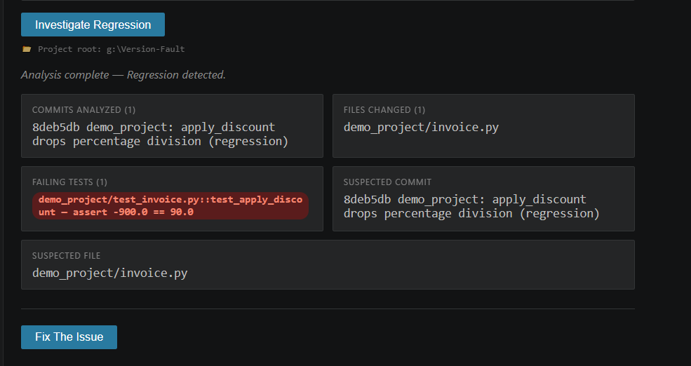
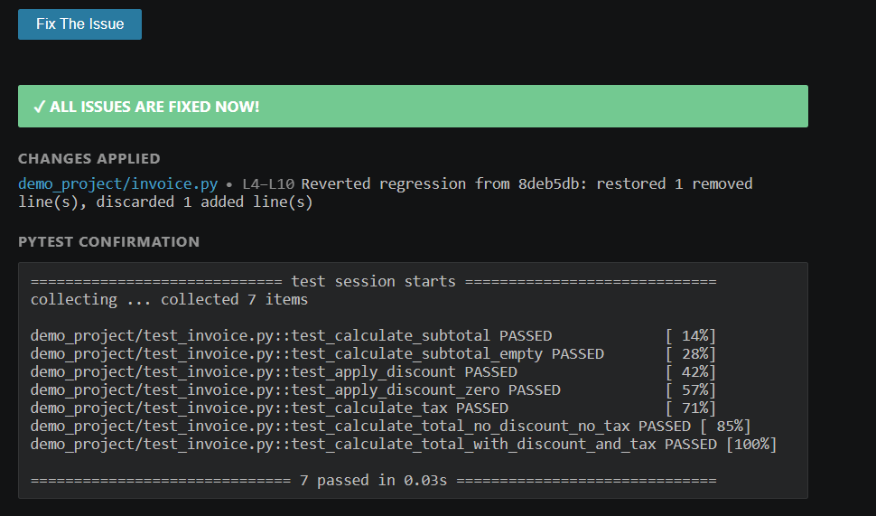

# Version Fault

> **Turn a broken release into a diagnosed, fixed, and verified one — automatically, inside your editor.**

**Version Fault** is a VS Code extension that automatically finds, explains, and fixes software regressions — bugs that surface when a previously working release breaks after a new change.

It combines Git history analysis, automated test evidence, and **IBM Bob** investigation and repair into a single **Investigate Regression** workflow, executed without leaving your editor.

---

## The Problem

Every developer has encountered this scenario:

> "It worked in the last release. Now it's broken. Something in between broke it — but what, and why?"

Triaging a regression today means manually:

- Diffing two versions or tags to identify what changed
- Re-running the test suite to find what fails and how
- Reading through commits one by one to locate the culprit
- Reasoning about root cause by hand
- Writing a fix and verifying it works

This process is slow, repetitive, and cognitively demanding — especially under time pressure, in unfamiliar codebases, or in on-call scenarios. Version Fault automates this investigative workflow end-to-end.

---

## What Version Fault Does

Given a **working release** (e.g. `v1.0`) and a **broken release** (e.g. `v2.0`), Version Fault:

1. Collects **Git evidence** — commits, changed files, and diffs between the two versions
2. Collects **test evidence** — runs `pytest` and captures exactly which tests fail and why
3. Combines both into a single structured evidence report (`reports/regression_context.md`)
4. Hands that report to **IBM Bob**, which:
   - Investigates the evidence to identify the most likely root-cause commit or function
   - Explains its reasoning in plain language
   - Plans the smallest safe fix
   - Applies the fix via Bob Agent mode
5. Re-runs the test suite to **verify** the fix resolves the regression

If all tests pass, Version Fault reports: **Regression Fixed.**

---

## Architecture

Version Fault is a **thin VS Code shell around a Python analysis engine**, with IBM Bob handling all reasoning and repair.

```
VS Code Extension (TypeScript)
        │
        ▼
Python Analyzer Engine
  ├── git_analyzer.py     →  commits, changed files, full diff
  ├── pytest_analyzer.py  →  test run, failing test, error output
  └── report_generator.py →  structured markdown evidence report
        │
        ▼
reports/regression_context.md
        │
        ▼
IBM Bob
  ├── Reads report, source, tests, and Git history
  ├── Identifies the likely root cause and explains it
  ├── Plans the minimal, safe fix
  └── Applies the fix (Agent mode)
        │
        ▼
pytest re-run  →  Verified Fixed
```

### Component Breakdown

| Layer | Technology | Responsibility |
|---|---|---|
| IDE Extension | TypeScript (VS Code API) | Command registration, webview panel, workflow orchestration |
| Analysis Engine | Python | Git diffing, pytest capture, evidence report generation |
| Version Comparison | Git CLI | Tag validation, commit log, file diff extraction |
| AI Investigation & Repair | IBM Bob | Root-cause analysis, fix planning, code application, verification |
| Panel UI | VS Code Webview | Regression status display and evidence summary |

There is intentionally **no database, no cloud backend, and no custom ML model.** All reasoning comes from IBM Bob operating over the structured evidence that Python collects.

---

## Workflow

1. Open a Python repository in VS Code with the Version Fault extension installed
2. Open the **Version Fault** panel from the command palette (`Version Fault: Investigate Regression`)
3. Select the last **working** release (e.g. `v1.0`) and the **broken** release (e.g. `v2.0`)
4. Click **Investigate Regression**
5. The Git Analyzer collects commits, changed files, and diffs between the two tags
6. The Test Analyzer runs `pytest` and captures the failing test and full error output
7. The Report Generator writes `reports/regression_context.md` — a single, clean evidence file
8. IBM Bob reads the report alongside the source, tests, and Git history
9. Bob identifies the most likely bad commit or function and explains its reasoning
10. Bob produces a minimal, safe fix plan
11. Bob Agent applies the fix to the source code
12. `pytest` is re-run automatically
13. If all tests pass, the panel displays **Regression Fixed**

---

## Key Features

| Feature | Description |
|---|---|
| Release Selector | Choose the working and broken versions to compare (`v1.0` → `v2.0`) |
| Git Analyzer | Extracts commits, changed files, and unified diffs between two tags |
| Test Analyzer | Runs `pytest`, captures failing tests, and records full error traces |
| Context Generator | Produces a single structured evidence file for Bob to reason over |
| Bob Investigation | Studies Git, test, and source evidence to identify the root cause |
| Bob Repair | Plans and applies the smallest correct fix |
| Verification | Re-runs the test suite to confirm the regression is resolved |

---

## Project Structure

```
version-fault/
├── extension/
│   └── versionfault/
│       ├── src/
│       │   ├── extension.ts       # Extension entry point and command registration
│       │   └── panel.ts           # Webview panel, workflow orchestration, UI logic
│       ├── package.json
│       └── tsconfig.json
├── analyzer/
│   ├── git_analyzer.py            # Git tag validation, commit log, diff extraction
│   ├── pytest_analyzer.py         # pytest execution and failure capture
│   ├── report_generator.py        # Combines evidence into regression_context.md
│   └── fix_issue.py               # Drives Bob's fix application and post-fix verification
├── demo_project/
│   ├── invoice.py                 # Demo module used to demonstrate a real regression
│   └── test_invoice.py            # Test suite for the demo module
├── reports/                       # Generated evidence reports (regression_context.md)
├── bob_sessions/                  # Bob task-session summary screenshots (hackathon evidence)
├── requirements.txt
└── README.md
```

---

## Getting Started

### Prerequisites

- VS Code `^1.80.0`
- Python `3.8+`
- Git available on `PATH`
- IBM Bob IDE, installed and signed in

### Installation

```bash
# Clone the repository
git clone https://github.com/Afnan-Hafiz/Version-Fault.git
cd Version-Fault

# Install Python dependencies
pip install -r requirements.txt

# Install and compile the extension
cd extension/versionfault
npm install
npm run compile
```

Open the `extension/versionfault` folder in IBM Bob, press `F5` to launch the Extension Development Host, and run **Version Fault: Investigate Regression** from the command palette.

### Packaging as a VSIX (for a permanent local install)

Instead of running via the F5 debug host every time, package the extension into a single installable file:

```bash
cd extension/versionfault
npm install -g @vscode/vsce   # one-time, if not already installed
vsce package
```

This produces `versionfault.vsix` in the `extension/versionfault` folder. Install it directly:

1. Open IBM Bob.
2. Go to the Extensions view.
3. Click the **...** menu → **Install from VSIX...**
4. Select `versionfault.vsix`.
5. Reload the window when prompted.

The extension now runs permanently, without needing `F5` or a debug host.

### Running the Demo

The `demo_project/` directory contains a pre-built regression scenario using an invoice calculation module (`invoice.py`) and its test suite (`test_invoice.py`). It is tagged at `v1.0` (working) and `v2.0` (broken), giving you a complete, reproducible end-to-end demonstration out of the box.

**Exact demo steps (as run for judging):**

1. Check out `v1.0` and run `pytest` — all tests pass.
2. Check out `v2.0` (or view it via the extension) — `pytest` now shows 2 failing tests.
3. Open the **Version Fault** panel inside IBM Bob.
4. Set Working release to `v1.0` and Broken release to `v2.0`.
5. Click **Investigate Regression**.
6. The panel displays: commits analyzed, files changed, and the failing test(s), plus a link to the generated evidence report.
7. IBM Bob reads `reports/regression_context.md` and identifies the likely bad commit/function, explaining its reasoning.
8. Bob (Agent mode) applies the fix directly to `demo_project/invoice.py`.
9. `pytest` is re-run automatically.
10. The panel displays **Regression Fixed**.

**Before / after result:**

| | Before (v2.0, regression present) | After (Bob's fix applied) |
|---|---|---|
| `pytest` result | 5 passed, **2 failed** | **7 passed**, 0 failed |
| Root cause | `apply_discount` in `invoice.py` divides by `100` was removed, so a 10% discount was applied as 1000% | Division restored; discount rate correctly normalized |

**Run the same analyzers manually, outside the extension, to inspect raw output:**

```bash
# From the repo root
python analyzer/git_analyzer.py v1.0 v2.0
python analyzer/pytest_analyzer.py
python analyzer/report_generator.py
```

---

## Scope

Version Fault is a focused tool for one well-defined problem. It is deliberately **not**:

- A CI/CD platform or pipeline replacement
- A general-purpose AI coding assistant
- A custom-trained or fine-tuned ML model
- A database-backed or cloud service
- A static analysis system
- A tool covering unrelated developer workflows

The goal is a reliable, end-to-end demonstration of one thing: **turning a regression into a diagnosed and verified fix, automatically.**

---

## Why This Matters

Regression triage is among the most common and cognitively expensive tasks in software maintenance — particularly when the change set is large or the codebase is unfamiliar. By automating evidence collection across Git and test infrastructure, and pairing it with AI-driven root-cause investigation and code repair, Version Fault compresses what can be hours of manual investigation into a single command, ending with a verified, tested fix rather than a guess.

---

## Team Roles

| Member | Responsibility | Output |
|---|---|---|
| Member 1 | IDE Extension Shell — command, panel, wiring to Python | `extension/versionfault/` |
| Member 2 | Git Analyzer — commits, changed files, diffs between two tags | `analyzer/git_analyzer.py`, `git_analysis.json` |
| Member 3 | Test Analyzer + Report Generator — runs pytest, captures failures, builds evidence report | `analyzer/pytest_analyzer.py`, `reports/regression_context.md` |
| Member 4 | IBM Bob Workflow — investigation prompts, Agent-mode fix, verification, demo project | `analyzer/fix_issue.py`, `demo_project/`, Bob workflow |

*(Replace with actual names before submission.)*

---

## Screenshots

### Investigate Regression — evidence gathered

The panel shows the commit and file suspected of causing the regression, the failing test with its assertion error, and offers a **Fix The Issue** action.



### After Bob applies the fix — verified



Bob reverts the regression-causing change in `demo_project/invoice.py`, re-runs the full test suite, and confirms all **7 tests pass**.

---

## Hackathon Evidence

Bob IDE task-session summary screenshots documenting how this project was built are available in [`bob_sessions/`](bob_sessions/).

---

## License

MIT — see [LICENSE](LICENSE).
